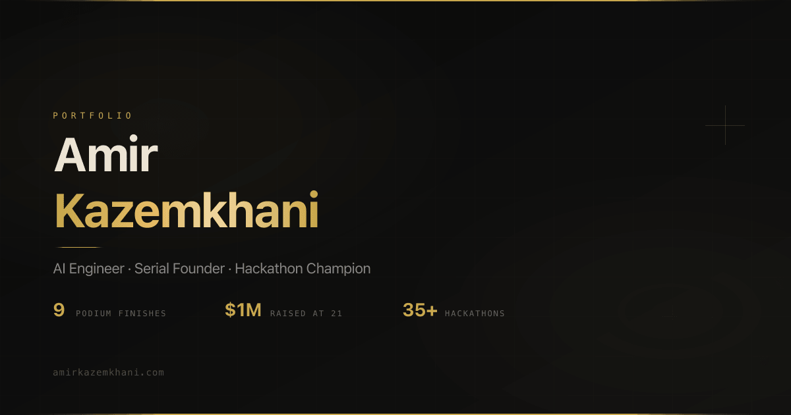

<p align="center">
  <a href="https://amirkazemkhani.com">
    
  </a>
</p>

# amirkazemkhani.com

[](https://github.com/Kazemkhani/amirkazemkhani.com/actions/workflows/ci.yml)

The source for my personal engineering home: selected AI systems, field notes, and the work behind NOVA Labs.

[Visit the live site](https://amirkazemkhani.com) · [Explore the writing](https://amirkazemkhani.com/articles) · [Work with me](https://amirkazemkhani.com/work-with-me)

## What this site is built to do

- Explain my focus in one pass: production voice agents, evaluation infrastructure, and open developer tools.
- Show real work and operating evidence instead of a generic résumé.
- Publish durable technical writing under a fast, accessible interface.
- Provide one clear path for collaborators, founders, and engineering teams to get in touch.

## Selected open work

| Project | What it demonstrates |
| --- | --- |
| [nova-mcp](https://github.com/Kazemkhani/nova-mcp) | A tested Model Context Protocol server for operating NOVA voice-agent infrastructure. |
| [outbound-intelligence-engine](https://github.com/Kazemkhani/outbound-intelligence-engine) | An AI-native research and outbound workflow built around explainable account intelligence. |
| [phantom-transition](https://github.com/Kazemkhani/phantom-transition) | A focused developer tool for creating polished shared-element page transitions. |
| [real-estate-odoo](https://github.com/Kazemkhani/real-estate-odoo) | A production-minded Odoo module for real-estate operations. |

## Architecture

This is a static, client-rendered React application built for a small operational footprint.

- React 18 and TypeScript
- Vite 8 for development and production builds
- Wouter for lightweight routing
- Tailwind CSS and Radix primitives for the interface system
- Framer Motion with reduced-motion support
- Self-hosted fonts and optimized AVIF/WebP image variants
- Optional Plausible analytics; no analytics request is made unless configured
- Vercel rewrites for SPA routing

The visual and interaction rules are documented in [`docs/DESIGN-DOCTRINE.md`](docs/DESIGN-DOCTRINE.md).

## Run locally

Requires Node.js 22.12 or newer.

```bash
git clone https://github.com/Kazemkhani/amirkazemkhani.com.git
cd amirkazemkhani.com
npm ci
cp .env.example .env.local
npm run dev
```

The optional environment variables are:

```dotenv
VITE_PLAUSIBLE_DOMAIN=
VITE_CAL_URL=
```

Leave both unset for a fully local, analytics-free build.

## Verification

```bash
npm run build
npm audit
```

Pull requests run the production build on the active Node.js LTS lines. The current dependency audit is clean.

## Content and asset rights

The source is public for technical transparency. No license is granted for the personal photographs, written content, name, logos, or other brand assets in this repository unless expressly stated.
